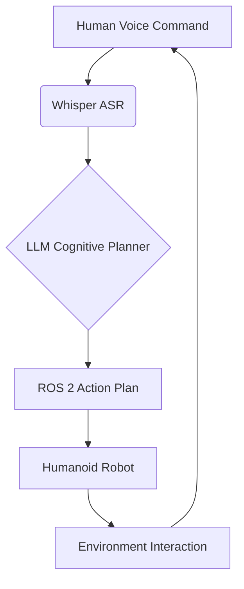

# Chapter 0.7: Appendices

This chapter serves as a collection of supplementary materials, including a glossary of key terms, examples of diagrams used throughout the course (using Mermaid and SVG formats), and any other relevant resources that enhance understanding.

## 1. Glossary of Terms

A comprehensive list of key terms and definitions used throughout the "Physical AI & Humanoid Robotics" course.

-   **AI (Artificial Intelligence)**: The simulation of human intelligence processes by machines, especially computer systems.
-   **Embodied AI**: Artificial intelligence systems that learn and interact with the physical world through a body (e.g., a robot).
-   **Humanoid Robot**: A robot designed to resemble the human body in form.
-   **ROS 2 (Robot Operating System 2)**: An open-source, meta-operating system for robots, providing services typical for hardware abstraction, low-level device control, implementation of common functionality, message-passing between processes, and package management.
-   **rclpy**: The Python client library for ROS 2.
-   **URDF (Unified Robot Description Format)**: An XML file format in ROS used to describe all elements of a robot.
-   **SDF (Simulation Description Format)**: An XML format that describes robots and objects for simulators like Gazebo.
-   **Digital Twin**: A virtual replica of a physical system or object, used for simulation, analysis, and monitoring.
-   **Gazebo**: A 3D dynamic simulator that allows you to accurately and efficiently test your robot algorithms.
-   **Unity**: A real-time 3D development platform used for creating interactive experiences, including high-fidelity robot visualizations and HRI.
-   **HRI (Human-Robot Interaction)**: The study of interactions between humans and robots.
-   **NVIDIA Isaac Sim**: A scalable robotics simulation application and synthetic data generation tool built on NVIDIA Omniverse.
-   **Isaac ROS**: Hardware-accelerated ROS 2 packages developed by NVIDIA for high-performance robotics applications.
-   **VSLAM (Visual Simultaneous Localization and Mapping)**: A process used by robots to concurrently build a map of an unknown environment and, at the same time, estimate their own location within that map using visual input.
-   **VLA (Vision-Language-Action)**: A type of AI system that combines visual perception, natural language understanding, and robotic action to enable intelligent interaction with the world.
-   **Whisper**: An open-source automatic speech recognition (ASR) system developed by OpenAI.
-   **LLM (Large Language Model)**: A type of artificial intelligence program that can generate human-like text responses, used in this context for cognitive planning for robots.
-   **Jetson**: A series of embedded computing boards from NVIDIA, designed for edge AI and robotics applications.

## 2. Diagram Examples (Mermaid & SVG)

Throughout the course, various diagrams will be used to illustrate complex concepts, system architectures, and data flows. These diagrams will primarily leverage Markdown-compatible formats such as Mermaid and SVG for easy integration and version control.

### 2.1. Mermaid Diagram Example (Placeholder)



_Description_: This is a placeholder for a Mermaid diagram illustrating the high-level Vision-Language-Action (VLA) pipeline, showing the flow from a human voice command to robot interaction.

### 2.2. SVG Diagram Example (Placeholder)

```xml
<svg width="200" height="100" xmlns="http://www.w3.org/2000/svg">
  <rect x="10" y="10" width="80" height="80" fill="blue"/>
  <circle cx="150" cy="50" r="40" fill="red"/>
  <text x="15" y="55" font-family="Arial" font-size="20" fill="white">ROS2</text>
  <text x="130" y="55" font-family="Arial" font-size="20" fill="white">Isaac</text>
</svg>
```

_Description_: This is a placeholder for a simple SVG diagram illustrating two core components (ROS2 and Isaac) of the robotics stack. Actual diagrams will be more complex and domain-specific.

## 3. Further Reading & Resources

A curated list of external resources, research papers, and relevant documentation for students who wish to delve deeper into specific topics. This section will be populated with links throughout the modules.
