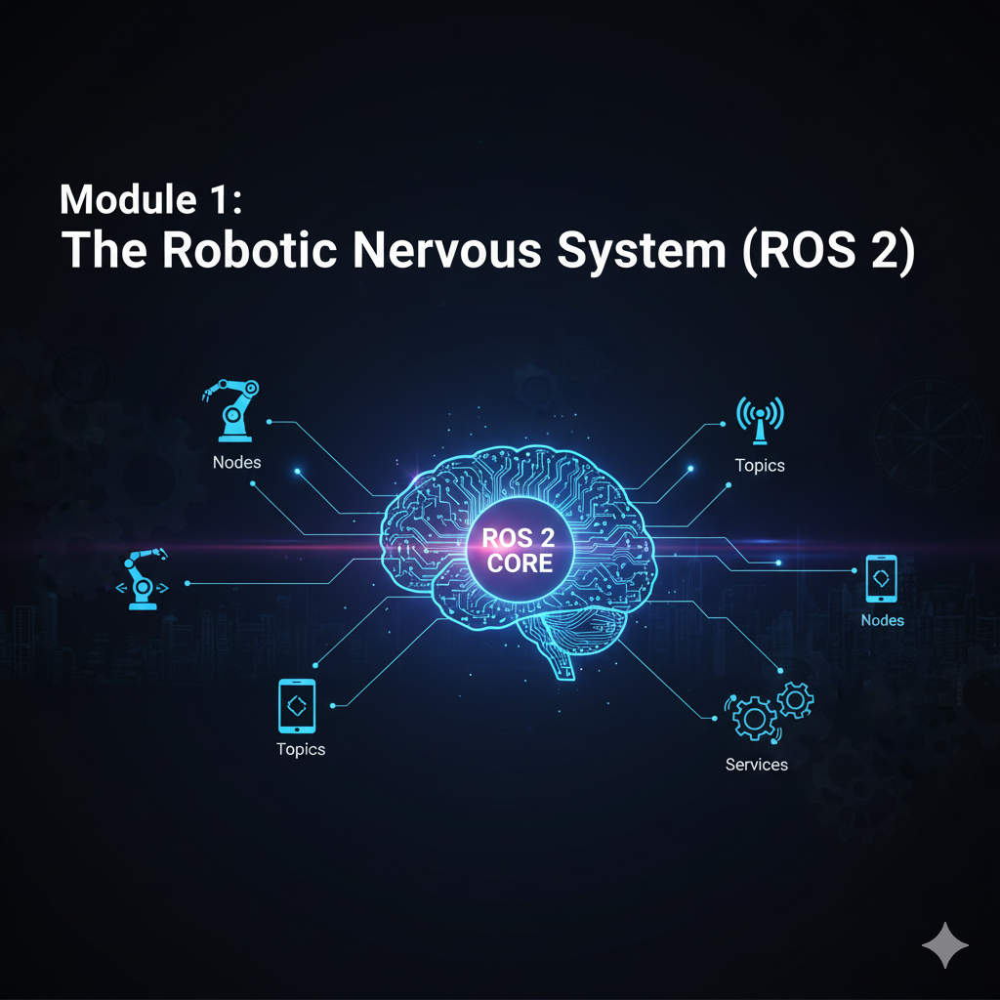

# Chapter 1.1: Introduction to ROS 2 and Humanoid Control

## The Rise of Robotic Operating Systems

As robotics systems grow in complexity, integrating various sensors, actuators, and intelligent behaviors becomes a significant challenge. This is where a Robotic Operating System (ROS) becomes indispensable. ROS provides a standardized framework for robotic software development, offering tools, libraries, and conventions that simplify the creation of sophisticated robotic applications.

While initially developed by Stanford University and later maintained by Willow Garage, ROS has evolved significantly. **ROS 2** represents the next generation of this powerful framework, designed to address the limitations of its predecessor (ROS 1) in areas such as real-time performance, multi-robot systems, and enterprise deployment. ROS 2 leverages Data Distribution Service (DDS) for efficient and reliable communication, making it more suitable for production-grade robotics.

## Why ROS 2 for Humanoid Control?

Humanoid robots are among the most complex robotic platforms. They possess numerous degrees of freedom, require intricate control schemes for balance and locomotion, and need to integrate various perception systems to interact intelligently with their environment. ROS 2 offers several key advantages for humanoid control:

1.  **Modularity**: ROS 2 promotes a modular architecture, allowing different functionalities (e.g., motor control, sensor processing, path planning) to be developed and run as independent "nodes." This simplifies development, testing, and debugging of complex humanoid systems.
2.  **Inter-process Communication**: DDS-based communication (Topics, Services, Actions) provides robust, low-latency data exchange between nodes, crucial for the tight feedback loops required in humanoid control.
3.  **Hardware Abstraction**: ROS 2 provides a layer of abstraction over diverse hardware components, enabling developers to write high-level control algorithms without worrying about the specifics of motor drivers or sensor interfaces.
4.  **Extensive Tooling**: ROS 2 comes with a rich set of tools for visualization (RViz), debugging (ros2bag), and package management, all of which are invaluable for developing and analyzing humanoid robot behaviors.
5.  **Community Support**: A large and active global community contributes to ROS 2, providing a wealth of resources, packages, and support for various robotics applications, including humanoid research.

## Fundamentals of Humanoid Control

Controlling a humanoid robot involves orchestrating its many joints to achieve desired poses, movements, and interactions. At a high level, humanoid control can be broken down into several layers:

-   **Low-Level Joint Control**: Directly commanding individual motors to reach specific positions, velocities, or torques.
-   **Kinematics**:
    -   **Forward Kinematics**: Calculating the position and orientation of the robot's end-effectors (e.g., hands, feet) based on its joint angles.
    -   **Inverse Kinematics**: Determining the required joint angles to achieve a desired end-effector pose. This is fundamental for tasks like reaching for an object or placing a foot.
-   **Dynamics**: Dealing with the forces and torques that cause motion, essential for stable locomotion and interaction with the environment.
-   **Balance and Stability**: Humanoid robots are inherently unstable. Control strategies are needed to maintain balance, especially during walking or manipulation tasks. Concepts like the Zero Moment Point (ZMP) are often employed.
-   **Locomotion**: Generating stable walking gaits or other forms of movement across various terrains.
-   **Manipulation**: Controlling the robot's arms and hands to interact with objects.

In this module, we will primarily focus on using ROS 2 to interface with and command the lower and mid-level control aspects of humanoid robots in simulation, laying the groundwork for more advanced behaviors in subsequent modules.

## Getting Started with ROS 2

Before diving into hands-on exercises, ensure your development environment is set up according to Chapter 0.4: Software Stack. This includes having Ubuntu 22.04 LTS installed and your chosen ROS 2 distribution (Humble or Iron) configured.

In the following chapters, we will explore the core concepts of ROS 2 and begin building our first ROS 2 packages for controlling humanoid robots.
