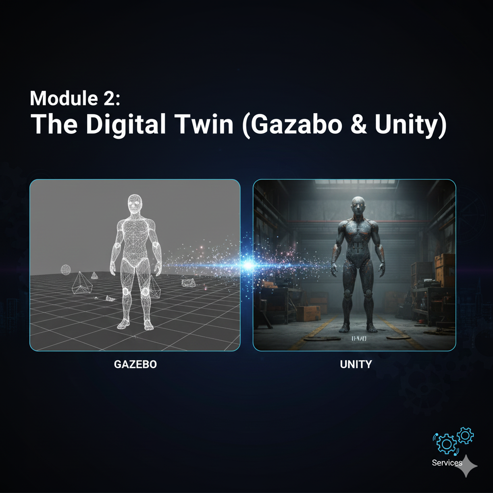

# Chapter 2.1: Understanding Digital Twins

## The Concept of a Digital Twin

In the complex world of robotics, especially for systems like humanoid robots, developing and testing directly on physical hardware presents numerous challenges: cost, risk of damage, safety concerns, and difficulty in reproducing scenarios. This is where the concept of a **Digital Twin** becomes invaluable.

A Digital Twin is a virtual replica of a physical system, object, or process. It's not just a 3D model; it's a dynamic, living counterpart that mimics the behavior, properties, and state of its physical twin in real-time or near real-time. This synchronization allows for:

-   **Monitoring**: Real-time insights into the physical system's performance and health.
-   **Simulation**: Testing new behaviors, control algorithms, or environmental conditions without affecting the physical counterpart.
-   **Analysis**: Predicting performance, identifying potential failures, and optimizing operations.
-   **Training**: Providing a safe and accessible environment for human operators or AI agents to train.

The core idea is a bidirectional data flow: data from the physical system feeds into the digital twin, updating its state and enabling accurate simulation and analysis. Conversely, insights and validated control strategies from the digital twin can be used to inform and optimize the physical system.

## Why Digital Twins for Humanoid Robotics?

Humanoid robots are complex, expensive, and delicate machines. A physical humanoid robot requires significant infrastructure, power, and careful handling. Digital twins offer compelling advantages for their development:

1.  **Safety**: Experimenting with new gaits, balance algorithms, or interaction sequences on a physical humanoid carries a high risk of damaging the robot or injuring nearby personnel. A digital twin allows for safe, consequence-free experimentation.
2.  **Cost Reduction**: Physical robots are expensive to acquire, maintain, and repair. Developing and testing extensively in a simulated environment drastically reduces development costs and the need for physical prototypes.
3.  **Accelerated Development**: Iterating on control algorithms, perception systems, or even hardware designs is much faster in simulation. You can run hundreds or thousands of simulations in the time it takes to conduct a few physical tests.
4.  **Reproducibility**: It's often difficult to precisely reproduce environmental conditions in the real world. Digital twins allow for exact replication of scenarios, which is crucial for debugging and validating algorithms.
5.  **Data Generation**: Digital twins can be used to generate vast amounts of synthetic data for training AI models, especially for perception tasks. This is particularly useful when real-world data collection is hazardous, expensive, or time-consuming.
6.  **Accessibility**: Not every student or researcher has access to a physical humanoid robot. A digital twin makes advanced humanoid robotics development accessible to a wider audience.
7.  **Human-Robot Interaction (HRI) Prototyping**: Digital twins can serve as excellent platforms for prototyping and testing HRI interfaces and experiences before deploying them to a physical robot.

## Components of a Humanoid Digital Twin

For a humanoid robot, a digital twin typically comprises several key components:

-   **Robot Model**: A detailed 3D model (e.g., URDF/SDF) describing the robot's kinematics, dynamics, visual appearance, and collision properties.
-   **Physics Engine**: A software component that simulates physical interactions like gravity, friction, collisions, and joint constraints (e.g., provided by Gazebo).
-   **Sensor Models**: Realistic simulations of the robot's sensors (e.g., cameras, LiDAR, IMU, force sensors), generating data that mimics real-world sensor outputs.
-   **Environment Model**: A 3D model of the robot's operating environment, including objects, terrains, and lighting conditions.
-   **Control Interface**: A connection to the robot's control system (e.g., ROS 2 `ros2_control`) that allows sending commands to the simulated robot and receiving its state.
-   **Visualization Tools**: Software to render the digital twin and its environment in a human-understandable way (e.g., RViz, Unity).
-   **Data Synchronization**: Mechanisms to keep the digital twin's state synchronized with its physical counterpart if one exists (though for much of this course, the focus will be on purely simulated twins).

## Digital Twins in this Course

In this module, we will focus on building and interacting with digital twins primarily using **Gazebo** for physics simulation and **Unity** for enhanced visual fidelity and Human-Robot Interaction (HRI) prototyping. Later, in Module 3, we will explore the advanced capabilities of NVIDIA Isaac Sim, which offers a highly integrated platform for both photorealistic simulation and synthetic data generation.

The goal is to provide you with the skills to create robust and realistic digital representations of humanoid robots, enabling you to develop and test complex behaviors efficiently and safely.
