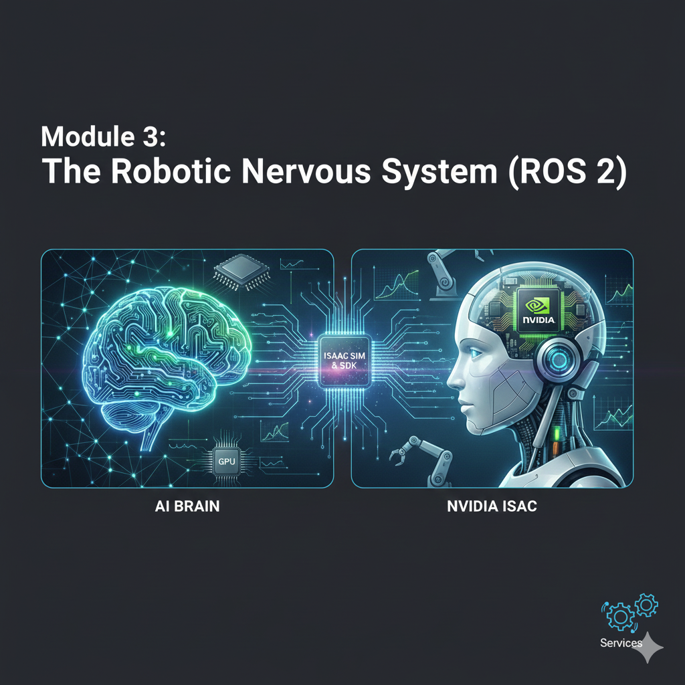

# Chapter 3.1: Introduction to Isaac Sim and Its Ecosystem

In the previous module, we explored digital twins using Gazebo and Unity. While these are powerful tools, the demands of modern AI-driven robotics—especially those involving high-fidelity perception, large-scale data generation, and complex scene interaction—often require more advanced simulation capabilities. This is where **NVIDIA Isaac Sim**, built on the **NVIDIA Omniverse** platform, emerges as a leading solution.

## 1. What is NVIDIA Isaac Sim?

NVIDIA Isaac Sim is a scalable robotics simulation application and synthetic data generation tool that powers the development, testing, and management of AI-based robots. It provides a highly realistic, physically accurate virtual environment designed to bridge the gap between simulation and the real world (sim-to-real transfer).

Key characteristics of Isaac Sim include:

-   **Physically Accurate Simulation**: Utilizes NVIDIA PhysX 5, a high-fidelity physics engine, to simulate realistic interactions, rigid body dynamics, fluid dynamics, and more.
-   **Photorealistic Rendering**: Leverages NVIDIA RTX rendering technology for stunning visual realism, including advanced lighting, shadows, and material properties. This is crucial for training perception models where visual fidelity directly impacts sim-to-real performance.
-   **Synthetic Data Generation (SDG)**: A core capability that allows users to programmatically generate vast quantities of diverse, labeled training data for AI models. This overcomes the challenges of collecting and annotating real-world data, which can be expensive, time-consuming, and dangerous.
-   **ROS 2 Integration**: Built from the ground up with ROS 2 compatibility, enabling seamless communication with your existing ROS 2 nodes, topics, services, and actions.
-   **Extensible and Programmable**: Isaac Sim is highly extensible, allowing users to build custom workflows, robots, and environments using Python scripting. It's built on Universal Scene Description (USD), an open-source framework for 3D content creation.
-   **Scalability**: Designed to run on powerful NVIDIA GPUs, offering scalable performance for large-scale simulations and data generation.

## 2. The NVIDIA Omniverse Platform

Isaac Sim is an application within the broader **NVIDIA Omniverse** platform. Omniverse is an extensible platform for virtual collaboration and real-time physically accurate simulation. It is built on three core pillars:

-   **Universal Scene Description (USD)**: An open-source, extensible file format developed by Pixar for robust interchange of 3D graphics data. USD acts as the "HTML for 3D," allowing different applications and users to collaborate on the same 3D scene.
-   **NVIDIA RTX Renderer**: Provides photorealistic, real-time ray tracing and path tracing, enabling stunning visual fidelity.
-   **NVIDIA PhysX**: A scalable multi-physics simulation engine that delivers highly accurate and realistic physical interactions.

Omniverse allows multiple users and applications to connect and collaborate in a shared virtual space, making it ideal for large-scale robotics development teams.

## 3. The Isaac Ecosystem

Beyond Isaac Sim, the NVIDIA Isaac ecosystem includes a suite of tools and platforms designed to accelerate robotics development:

-   **NVIDIA Jetson**: A series of embedded computing boards and modules designed for AI at the edge. Jetsons are popular platforms for deploying and running AI-powered robot applications due to their powerful GPUs and compact form factor.
-   **NVIDIA Isaac ROS**: A collection of hardware-accelerated ROS 2 packages that leverage NVIDIA GPUs on Jetson platforms (and discrete GPUs) to provide high-performance solutions for common robotics tasks like perception, navigation, and manipulation. These packages are optimized for real-time performance.
-   **NVIDIA Isaac SDK**: A complete toolbox for robotics development that provides frameworks, algorithms, and modules for perception, navigation, and manipulation. While newer developments emphasize Isaac ROS, the SDK provided many foundational components.
-   **Cloud Integration**: Isaac Sim and the broader Omniverse platform can be integrated with cloud resources, enabling large-scale, distributed simulation and data generation workflows.

## 4. Key Use Cases for Isaac Sim

-   **Perception Model Training**: Generating diverse synthetic data (images, point clouds, depth maps) with perfect ground truth labels to train deep learning models for object detection, segmentation, and pose estimation.
-   **Robot Fleet Simulation**: Simulating multiple robots in complex environments to test coordination, multi-agent navigation, and system-level performance.
-   **Digital Twin Operations**: Creating high-fidelity digital twins for predictive maintenance, remote operation, and optimization of physical robotic systems.
-   **Robot Design Iteration**: Rapidly prototyping and testing new robot designs and hardware configurations in a virtual environment.
-   **Reinforcement Learning**: Providing a high-speed, parallelizable simulation environment for training reinforcement learning agents to learn complex robot behaviors.

## Conclusion

NVIDIA Isaac Sim represents a significant leap forward in robotics simulation, offering unparalleled photorealism, physical accuracy, and synthetic data generation capabilities. Its integration within the NVIDIA Omniverse and Isaac ecosystem provides a powerful and comprehensive platform for developing advanced AI-driven humanoid robots. In the following chapters, we will dive deeper into how to leverage these capabilities for photorealistic simulation, synthetic data generation, and integrating Isaac ROS perception modules.
